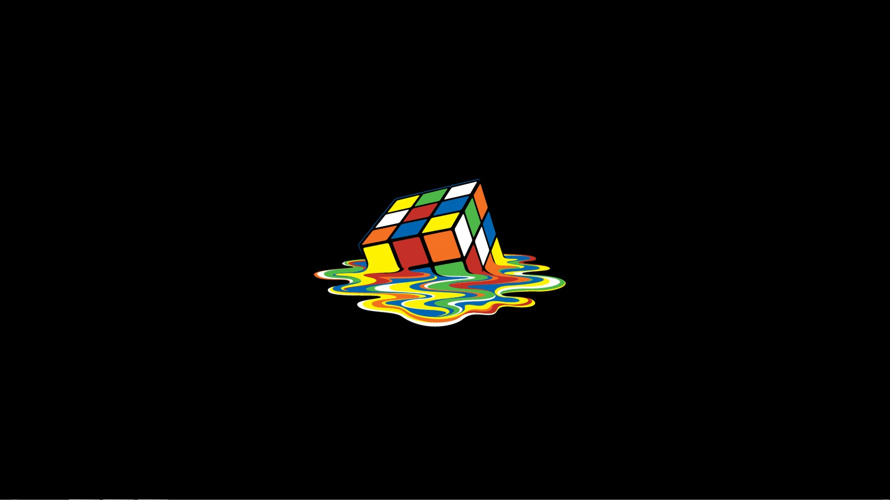
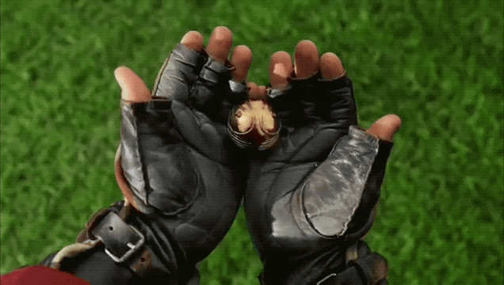

  <h1 align="center">Welcome to the Moon 🌑</h1>
  
<i>"Ah, <b>music</b>. A magic beyond all we do here!"</i>

   
  

   
   
   

  

    Hello, I am <b>Moon</b>. I am a third year student studying Computer Science and Mathematics at the University of British Columbia. You can reach out to me through any of the following:

 

    
     
     
    
    
    

 

  
  <a href="https://drive.google.com/file/d/1zbW7mj9xxfw9Kr6RZN6a0KqNQS9ym6p5/view?usp=share_link" style="font-size: 18px;">
  <b>My Resume<b>

   

  

    
    

</a>

 

    
    

  <!--    -->

 

    

   

   
   <!-- 
    -->

 
 
 

    
“Things we lose have a way of coming back to us in the end, if not always in the way we expect.”

    
<strong>Credits:</strong>

    
    
  

